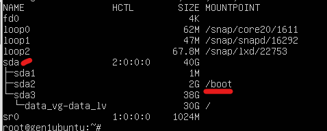
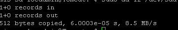
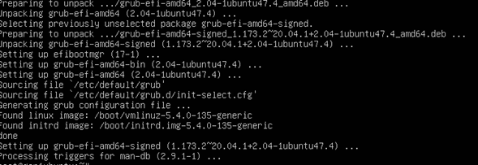
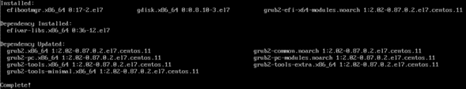
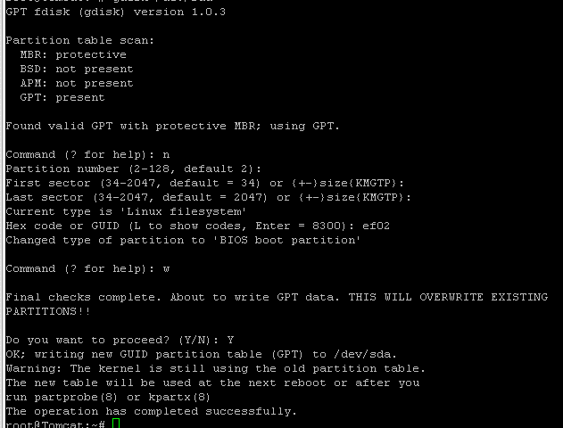
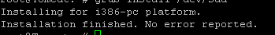
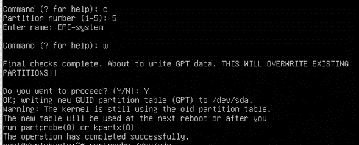
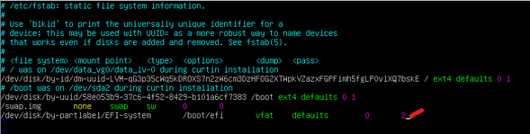
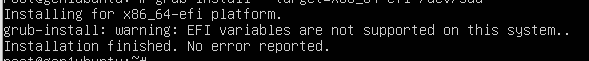
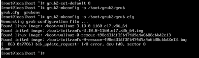

# (PREVIEW) Azure Gen1 to Gen2 Trusted Launch VM Upgrade

[Azure Generation 2 (Gen2) VM](https://learn.microsoft.com/azure/virtual-machines/generation-2) is based on UEFI-based boot architecture which enables key scenarios including [Trusted Launch (TLVM)](https://learn.microsoft.com/azure/virtual-machines/trusted-launch). Gen2 TLVM provides customers with secure compute solutions with security capabilities like:

Feature Name    |    Description
-|-
Secure Boot    |    Protects OS against rootkits and boot kits.
vTPM    |    It serves as a dedicated secure vault for keys and measurements, enabling attestation by measuring the entire boot chain of your VM
Guest VM Attestation    |    Guest attestation extension enables proactive attestation and monitoring the boot integrity of your VMs.

Newer OS like Windows Server 2022 Azure Edition require UEFI, Windows 11 requires UEFI & vTPM as pre-requisite for installation. Additionally, for enabling [Azure Compute security benchmark](https://learn.microsoft.com/azure/governance/policy/samples/guest-configuration-baseline-windows#secured-core) (like Secure Boot), UEFI support in OS is mandatory.

You can now upgrade existing Gen1 (BIOS) VMs to Trusted launch by on-boarding to preview at **https://aka.ms/Gen1ToTLUpgrade**.
This repository provides end users with PowerShell script-based guidance which they can self-execute & upgrade existing Gen1 (BIOS) VMs to Gen2 (UEFI) VMs.

**NOTE**: Please review the list of [Known issues](#known-issues) before executing validation.

**IMPORTANT DISCLAIMER**

**Production use:** The Preview should only be used for testing, evaluation and feedback. Production workloads are **not recommended.**

Preview features are not backed with Microsoft Support SLA.

## Pre-Requisites

Pre-Requisite    |    Description
-|-
On-board subscription for preview    |    Register for **Gen1 to Trusted launch upgrade preview** at https://aka.ms/Gen1ToTLUpgrade.
[Az PowerShell Module](https://learn.microsoft.com/powershell/azure/what-is-azure-powershell)    |    Required cmdlets for Azure Platform.
VM Contributor rights on Gen1 VM resource group.    |    Required RBAC permissions to modify and re-deploy Gen1 VM.
VM is in allocated / Running state.    |    Required to read current state and configuration of Gen1 VM and execute MBR to GPT conversion.
Operating System    |    Operating system should be [Trusted launch supported.](https://aka.ms/TrustedLaunch)<br/>**NOTE**: For Linux VMs, execute MBR to GPT locally on VM. Refer to steps [Linux MBR to GPT conversion](#linux-os-mbr-to-gpt-conversion)
Azure IaaS VM Agent    |    [Azure IaaS Windows VM Agent](https://learn.microsoft.com/azure/virtual-machines/extensions/agent-windows) OR [Azure IaaS Linux VM Agent](https://learn.microsoft.com/azure/virtual-machines/extensions/agent-linux) should be installed and healthy.
Disk Encryption    |    If enabled, Disable any OS disk encryption including Bitlocker, CRYPT, [Server side encryption with customer managed keys](https://learn.microsoft.com/azure/virtual-machines/disk-encryption) prior to upgrade. All disk encryptions should be re-enabled post successful upgrade.
VM Backup    |    Azure Backup if enabled for VM(s) should be configured with Enhanced Backup Policy. Trusted launch security type cannot be enabled for Generation 2 VM(s) configured with Standard Policy backup protection.<br/>Existing Azure VM backup can be migrated from Standard to Enhanced policy using private preview migration feature. Submit on-boarding request to preview using link https://aka.ms/formBackupPolicyMigration.
VM Disaster Recovery    |    Trusted launch VMs currently do not support Azure Site Recovery (ASR). If enabled, ASR should be disabled prior to upgrade.

## Best Practices

Best Practice    |    Description
-|-
Validate in lower environment    |    Enable Trusted launch on a test Generation 2 VM and ensure if any changes are required to meet the prerequisites before enabling Trusted launch on Generation 2 VMs associated with production workloads.
**Backup** Gen1 VM    |    Create restore point for Azure Generation 1 VM(s) associated with  workloads before enabling Trusted launch security type. You can use the Restore Point to re-create the disks and Generation 1 VM with the previous well-known state.

## High-Level Upgrade Workflow

Id    |    Step    |    Description
-|-|-
1    |    Validate Pre-Requisites    |    Validate pre-requisites for executing script:<ul><li>Az.Account, Az.Compute PowerShell modules<li>Csv location (Refer to [sampleCsv](./artifacts/sampleCsv.csv) for schema details.)</ul>
2    |    Connect Azure Subscription and read Gen1 VM Configuration    |    Store Gen1 VM Configuration required for conversion:<ul><li>OS Disk Metadata<li>VM Size</li></ul>
3    |    Validate VM SKU Trusted launch Support   |    Validate if current VM Size assigned to Gen1 VM supports Trusted launch. If not, VM Size for Gen1 VM will need to be updated with [Trusted launch support](https://aka.ms/TrustedLaunch).<br/>For steps of changing VM Size, please refer to [Change the size of a Virtual Machine](https://learn.microsoft.com/azure/virtual-machines/resize-vm?tabs=portal).
4    |    Execute MBR to GPT conversion    |    Script will execute online MBR to GPT conversion of OS disk boot partition.<br/>**Note**: For Linux VMs following assumptions are made:<ul><li>OS disk boot partition is mounted on `/dev/sda`.<li>VM is created using Azure marketplace image and not migrated from outside Azure cloud.</li></ul>
5    |    De-allocate and upgrade VM properties    |    Script will update the VM attributes from Gen1 to Gen2 and security type to Trusted launch.
6    |    Start VM    |    Post successful upgrade, VM will be started.

## Script execution

Parameter Name    |    Description    |    Mandatory
-|-|-
subscriptionId    |    Subscription ID for Gen1 VM to be upgraded.    |    True
tenantDomain    |    Primary AAD Domain Name for authentication. (For example, contoso.onmicrosoft.com)    |    True
csvLocation    |    Local file path location of csv containing vmName, vmResourceGroupName, enableSecureBoot details.    |    True

Csv column Name    |    Description    |    Mandatory
-|-|-
vmName    |    Resource Name of Gen1 VM to be upgraded.    |    True
vmResourceGroupName    |    Resource Group for Gen1 VM to be upgraded.    |    True
enableSecureBoot    |    If target Trusted Launch VM should be deployed with Secure Boot enabled (TRUE) or disabled (FALSE). By default set to **TRUE**.<br/>This option should be disabled if VM is hosting custom or unsigned boot drivers which cannot be attested.    |    False

**Example**

```azurepowershell
.\Upgrade-Gen1ToTL.ps1 -subscriptionId $subscriptionId -tenantDomain contoso.onmicrosoft.com -csvLocation "C:\Temp\sampleCsv.csv"
    
# Upgrade all VMs provided in csv from Gen1 to Trusted launch with specific parameter values.
```

## Post-Conversion Activities

After successful conversion of Gen1 to Trusted Launch VM, user needs to perform required steps for applicable scenarios from below list:

1. Validate health of Virtual Machine OS and workload hosted on converted Gen2 TLVM.
2. Re-enable all disk encryptions on Trusted launch virtual machine post successful upgrade.
3. Re-enable backup with Enhanced Policy post successful upgrade to Trusted launch virtual machine.

## Linux OS MBR to GPT conversion

Execute these steps on Linux Gen1 VM to complete MBR to GPT conversion before executing Gen1 -> Trusted Launch upgrade script.

**Note**: *Non-Azure* steps are applicable for Non-Azure Linux VMs only, i.e., Linux VMs created outside Azure cloud. These do not apply if the Linux VM has been created in Azure Cloud.

Id    |    Step    |    Description
-|-|-
1    |    Query the OS Disk using below command<br/> `lsblk -o NAME,HCTL,SIZE,MOUNTPOINT \| grep -i "sd"` | Identify the boot partition and associated disk<br/>
2    |    Backup MBR partition:<br/>`dd if=/dev/sda of=backup.mbr bs=512 count=1`    |    Backup should be taken on drive other than Boot drive.<br/>
3    |    **Non-Azure** Install `EFI Package`:<ul><li>**For Ubuntu**: `apt install grub-efi-amd64`<br/>*Note*: `grub-efi-amd64-signed` is recommended if supported by OS configuration.<li>**For RHEL**: `yum install gdisk grub2-x64-efi-modules efibootmgr dosfstools -y`</li></ul> | <br/>
4    |    Execute gdisk command `gdisk /dev/sda`to create new partition with following values:<br/><ul><li>Command: **n**<li>Partition Number: `default`<li>First Sector: **34**<li>Last Sector: **2047**<li>partition type **ef02**<li>Command: **w** to write the changes</ul>    |    
5    |    Update partition table changes:`partprobe /dev/sda`    |    
6    |    Install Bootloader in re-partitioned boot disk:<ul><li>**For Ubuntu**: `grub-install /dev/sda`<li>**For RHEL & SLES** `grub2-install /dev/sda`</ul>    |    
7    |    **Non-Azure** Execute gdisk to add an `EFI System` partition (ESP) with partition type **ef00**. Recommended size is **+200M** <br/>**Command**: `gdisk /dev/sda` |    
8    |    **Non-Azure** Execute gdisk to rename above created partition to `EFI-system`<br/>**Command**: `gdisk /dev/sda`    |    
9    |    **Non-Azure** Build vfat filesystem for ESP.<br/>`mkfs -t vfat -v /dev/disk/by-partlabel/EFI-system`    |    
10    |    **Non-Azure** If does not exists already; create ESP Mountpoint<br/>`mkdir /boot/efi`    |    
11    |    Copy existing files in /boot/efi to temporary /mnt/folder.<ol><li>`mount -t vfat /dev/disk/by-partlabel/EFI-system /mnt`<li>`mv  /boot/efi/* /mnt`<li>`umount /mnt`</li></ol>    |    
12    |    **Non-Azure** Add the ESP mountpoint to /etc/fstab. (replace spaces with tab key)<br/>`/dev/disk/by-partlabel/EFI-system /boot/efi vfat defaults 0 2`    |    
13    |    **Non-Azure** Mount ESP<br/>`mount /boot/efi`    |    
14    |    **Non-Azure** Install the GRUB EFI bootloader.<br/>**Ubuntu/Debian:**<br/>`grub-install --target=x86_64-efi /dev/sda`<br/>**RHEL:**<br/>`grub2-install --target=x86_64-efi /dev/sda`    |    <br/>

## Troubleshooting

### MBR2GPT - Windows

Share following log files available at `%windir%` with feature team to troubleshoot failures related to MBR2GPT execution for Windows VMs:

- setupact.log
- setuperr.log

## Known issues

### CRITICAL - Windows 11 boot fails

Windows 10 Gen1 VM is successfully upgraded to Trusted launch followed by successful Windows 11 in-place upgrade. However, the Windows 11 boot fails after Azure VM is stopped and started with below error.


Team is actively troubleshooting this issue.

### Gen1 to Trusted launch upgrade for Linux distros

Gen1 to Trusted launch upgrade script has been validated with Ubuntu 20.04 LTS distro. For other distros, **mandatorily** validate the upgrade in lower environment before running in production.

### Cannot find room for the EFI system partition

This error occurs for one of following reason:

- There is no free space available on the system volume
- System volume is corrupted. You can validate by trying to Shrink Volume by few MBs under Disk Management console. Use command `chkdsk C:/v/f` to repair system volume.
- `Virtual Disk Service` is not running or unable to communicate successfully.
- System volume disk is already configured with 4 MBR partitions (maximum supported by MBR disk layout). You need to delete one of the partition to make room for EFI system partition.
    1. Run `ReAgentc /info` to identify partition actively used by Recovery. Example: `Windows RE location:       \\?\GLOBALROOT\device\harddisk0\partition4\Recovery\WindowsRE`
    2. Run PowerShell cmdlet `Get-Partition -DiskNumber 0` to identify current partitions configured.
    3. Run PowerShell cmdlet `Remove-Partition -DiskNumber 0 -PartitionNumber X` to remove any extra **Recovery** partition not actively used by Recovery service as identified in Step 1.

### D Drive assigned to System Reserved Post upgrade

Temporary storage Drive letter assignment 'D' is changed to 'E' with previous letter assigned to System Reserved post-upgrade. The issue is being troubleshooted. execute below steps manually post-upgrade to workaround the issue:

After the upgrade check the disks on the server, if system reserved partition has the letter D:, do the following actions:

- reconfigure pagefile from D: to C:
- reboot the server
- remove letter D: from the partition
- reboot the server to show the temporary storage disk with D: letter
